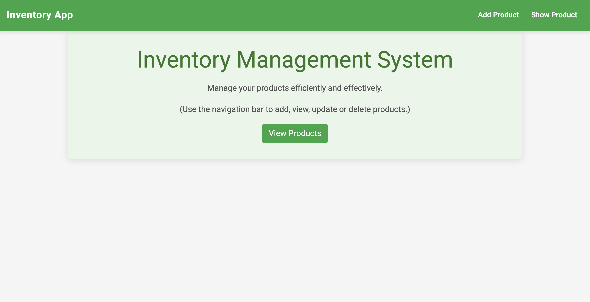
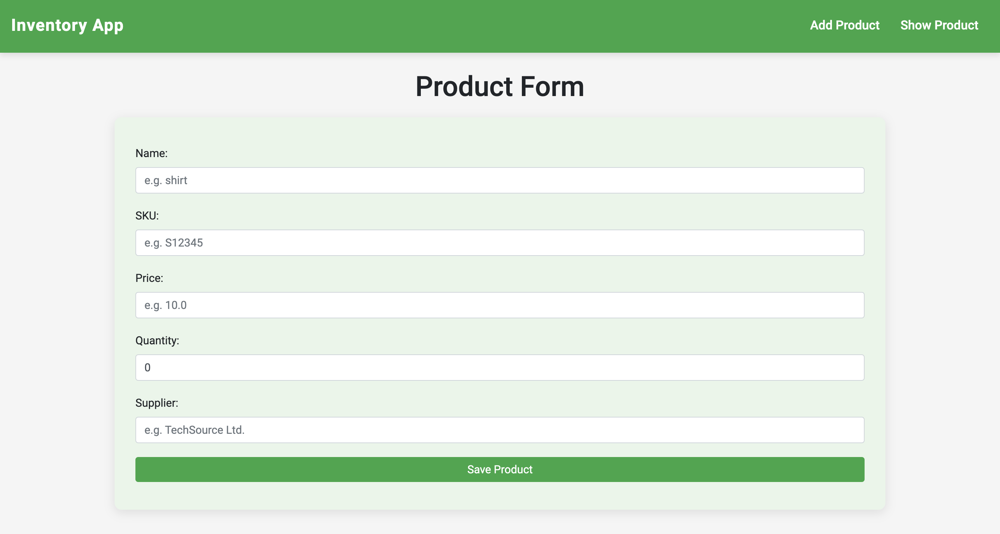
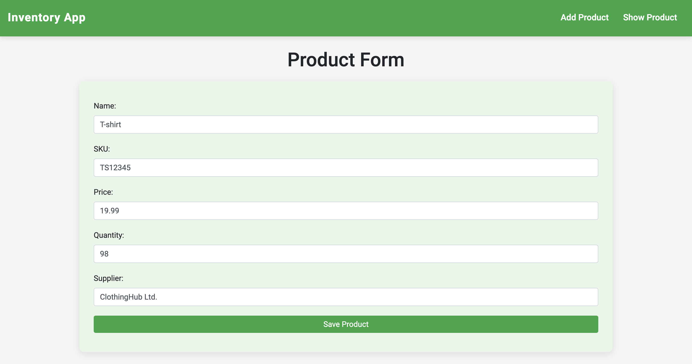
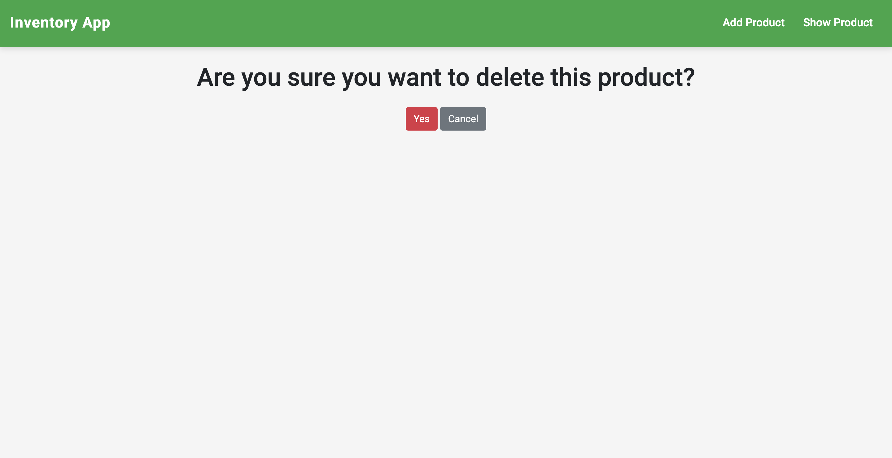
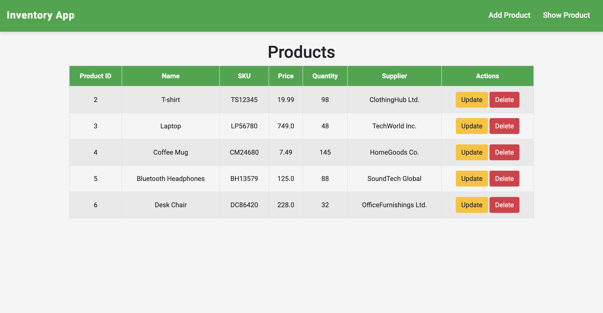

# Inventory Management System

## Overview

The **Inventory Management System** is a web application designed to help users efficiently manage their products. It allows users to add, view, update, and delete product information with ease.

## Features

- **User-Friendly Interface**: Intuitive design for easy navigation.
- **Product Management**: Add, view, update, and delete product entries.
- **Responsive Design**: Works well on both desktop and mobile devices.

## Technologies Used

- **Frontend**: HTML, CSS, JavaScript, Bootstrap
- **Backend**: Django
- **Database**: SQLite

## Usage

- **Add Product**: Use the "Add Product" link in the navigation bar to create a new product entry.
- **View Products**: Navigate to "Show Products" to view all existing products.
- **Update/Delete**: Modify or remove products as necessary.

## Screenshots

